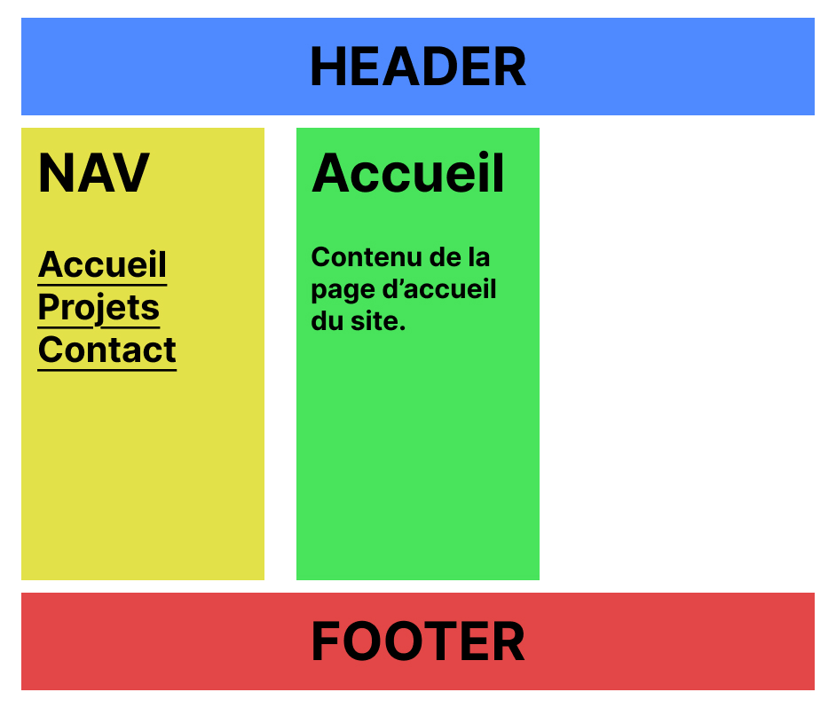
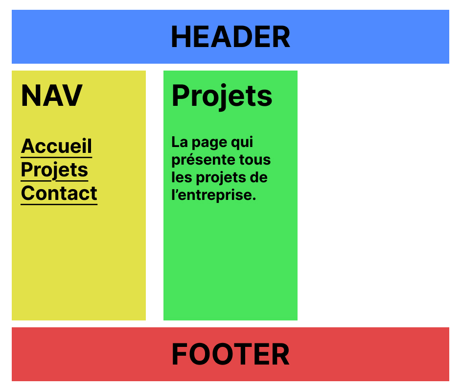
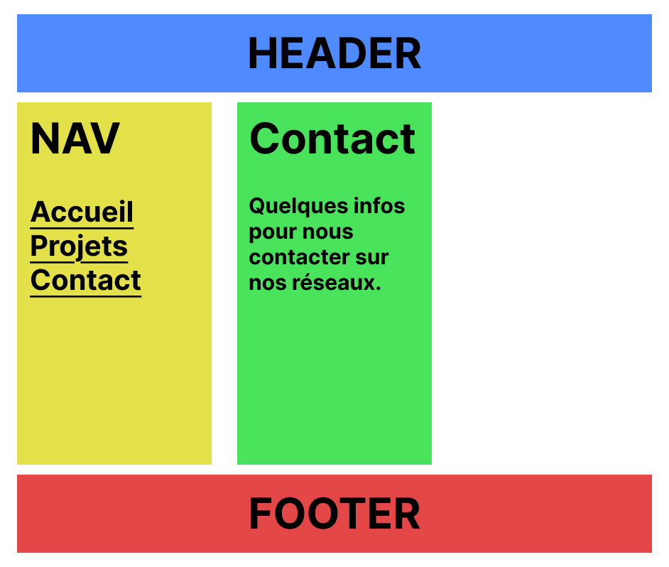

# Exercice PostHTML Include

## Installation

1. Cloner le repository
2. Ouvrir le dossier avec Visual Studio Code
3. Ouvrir une fenêtre de terminal dans Visual Studio Code et entrer la commande suivante :

```bash
npm install
```

## Travail

Depuis le terminal, entrer la commande suivante :

```bash
npm run dev
```

## Consigne

À l'aide de _postHTML_ et _css grid_ basez vous sur les screenshots ci-dessous pour recréer ce site web multipage avec trois composants réutilisables : header, nav et footer.

## Page Accueil



## Page Projets



## Page Contact


